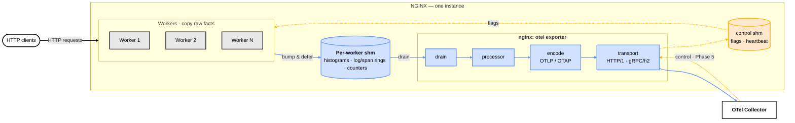

# ngx-otel-rust

A Rust dynamic [NGINX] module on the [`ngx-rust`] SDK that emits
OpenTelemetry signals to an OTel collector.  Designed for migration to
OTAP (OpenTelemetry Protocol with Apache Arrow) — the columnar evolution
of OTLP — in a later phase.

Everything it emits — metrics, logs, and (Phase 3) traces — is defined in
**[`TELEMETRY_MODEL.md`](TELEMETRY_MODEL.md)** (OTel-semantic-conventions format),
the producer-side contract, modelled on the F5 AVR nginx module (`avr-module/`)
with OTel-semconv names/units. See [Signals](#signals-what-this-module-emits).

[NGINX]: https://nginx.org/
[`ngx-rust`]: https://github.com/nginx/ngx-rust

## Status

**Phases 1.1–1.3 complete (OTLP/HTTP + OTLP/gRPC metrics from a dedicated
exporter process); pre-upstream-PR.**  Phase 2 (logs) is in design.

What works today:

- Per-worker shm counter slots written from a Log-phase handler — no
  allocations, no locks, no syscalls on the request path.  The handler's
  only branch is a single `Relaxed` atomic load on the control-shm flags
  word (a Phase 5 dynamic-reconfig placeholder; the value is discarded
  today).
- A dedicated `nginx: otel exporter` child process owns the entire cold
  path — the async export loop driving hyper-on-`ngx-rust` (no Tokio
  runtime).  Workers hold zero collector sockets; they bump shm counters
  and defer.
- Two production export transports, selected by `otel_export_protocol`:
  **OTLP/HTTP** over HTTP/1.1 (`otlp_http`, the default) and **OTLP/gRPC**
  unary over HTTP/2 (`otlp_grpc`).
- Stub-status equivalents (`nginx.connections.*`, `nginx.requests.total`)
  plus a histogram set inspired by F5 AVR
  (`http.server.request.duration`, request/response body size, upstream
  timings, upstream byte counts).  Full model in
  [`TELEMETRY_MODEL.md`](TELEMETRY_MODEL.md).
- OTLP protobuf encoding with vendored proto files; collector receives
  the expected Sum / Gauge / Histogram shapes with correct Cumulative
  temporality.
- Graceful drain on `nginx -s quit`, a crash-respawn supervisor for the
  exporter process, and SIGHUP reload safety (`old_config()` accessor,
  clean worker-generation transition; endpoint and protocol changes
  supported).  A control-shm heartbeat tracks exporter liveness.
- `http://` and `unix:` endpoints.  `https://` / TLS is not yet
  implemented (see [Limitations](#limitations)) and is deferred to a
  later phase.
- Zero-cost-when-disabled invariant verified statistically: ≤ 0.01%
  throughput delta (module-loaded-but-disabled vs no-module baseline)
  on isolated AWS EPYC and macOS arm64 hosts.  See
  `tests/bench/RESULTS.md`.

Validated by a **24-hour soak** on a dedicated AWS EPYC 9R14 instance
(2026-05-29 → 30): 45.2 billion requests at ~523k req/s sustained
(p99 200µs), bounded memory growth, and a live collector-downtime
injection in which nginx kept serving (HTTP 200 throughout), the
`ngx_otel.send_failures` / `ngx_otel.dropped_records` self-metrics
accounted every drop, and export recovered cleanly on collector restart.

Phase 2 onward (logs, traces, NGINX Plus, OTAP) is out of scope for this
README.  See the Confluence proposal (link below) for the full phase plan.

## Architecture

<!-- Context diagram per F5 Architecture Diagram Guidelines §1: left→right = origin→destination;
     IBM-palette plane colours (user traffic=black, telemetry=#648FFF, control=#FFB000) on both nodes
     and edges; cylinders = shared memory; labelled edges; colour key in the caption below. -->


*Colour = plane: **user traffic** (black) · **telemetry** (blue `#648FFF`) · **control** (amber `#FFB000`) — on nodes and edges. Cylinders = shared memory; rounded = external. The single cold-path exporter handles all signals; Phase-5 control feedback lands at the **exporter** (which owns the gRPC connection), and the exporter publishes flags that workers read on the hot path.*

Per-worker shm counter slots for instrumented metrics; atomic increments
from a Log-phase handler write to the worker's own slot only (no
cross-worker cache traffic).  A **dedicated `nginx: otel exporter` child
process** owns the entire cold path — an async export loop driven by
`ngx-rust`'s single-threaded executor that reads the worker slots plus
NGINX core's `ngx_stat_*` atomics, encodes via OTLP protobuf, and sends
either over [hyper] 1.x HTTP/1 or over OTLP/gRPC on HTTP/2 — both driven
on a `NgxConnIo` adapter that wraps `ngx_peer_connection_t` and uses
NGINX's event handlers for I/O readiness wakeup (no spinning, no
blocking).  Workers never open a collector connection.  A small control
shm carries a liveness heartbeat plus a flags word the workers load on
the request path (one `Relaxed` atomic read — the sole hot-path branch,
reserved for Phase 5 dynamic reconfiguration).  The `MetricSource` and
`Encoder` trait boundaries — plus the `ExportTransport` enum that
dispatches OTLP/HTTP vs OTLP/gRPC — keep an eventual OTAP / columnar
migration a swap, not a rewrite.

**Design principle: the worker copies raw facts and never encodes; all
wire-format work is cold-path.**  Workers do a bounded amount of
format-*independent* work; the exporter does everything format-specific.  On the request
path a worker only *aggregates and defers* — a fixed set of `Relaxed`
atomic increments into its own shm histogram slots, plus, for the
sampled exception tail only, a single bounded, allocation-free copy into
its own ring.  That work is constant per request, lock-free, and
syscall-free, and its cost does **not** depend on the telemetry wire
format.  Everything that *does* depend on the wire format — assembling
OTel records, OTLP protobuf encoding today, OTAP / columnar later — runs
only in the dedicated exporter on the cold path.  Because the data sits
in shm in a **protocol-neutral shape**, moving OTLP → OTAP is an encoder
swap inside one cold-path process and never reaches a worker or the
request path.

Three invariants follow.  **(1) The request path does zero wire-format
work** — it copies raw facts (atomic bumps + bounded memcpys into shm)
and never serialises; anything that shapes bytes for a wire format is
pushed to the cold path.  **(2) Read once, derive many** — each request
datum is read once, at the phase that owns it (inbound trace context at
the `rewrite` phase, parsed once and cached on the per-request context;
request outcome at the `log` phase, in one pass), and **every** signal
(metric, log, span) is derived from those captured reads — no signal
re-reads or re-scans a field another already read.  **(3) "Zero
wire-byte change" is the bar for refactoring telemetry code** — a change
that leaves the emitted OTLP bytes byte-for-byte identical is a pure
refactor (gated by the existing tests); a change that alters them is a
behaviour change, treated as such.  Invariants (1)–(2) govern *what a
worker does* per request; (3) governs *how we change the code that
produces bytes*.

This one dedicated exporter is deliberately the **single cold path for all
three signals** — metrics today, logs and traces in Phases 2–3 — so per-signal
differences stay confined to the shm shape on the left while one process owns
all collector I/O.  The per-worker-export alternative (the model the production
C++ `nginx/nginx-otel` module uses: a background thread and its own connection
in every worker) was weighed across all three signals and declined; the
reasoning and the conditions that would reverse it are recorded in the proposal
§6.5.

When `otel_exporter` is not configured the Log-phase handler is not
registered and the exporter process is not spawned — no work runs on the
request path, no background process runs.  This is the
"zero-cost-when-disabled" invariant the module's upstream-acceptance
case rests on.

[hyper]: https://hyper.rs/

## Signals (what this module emits)

The full producer-side contract — every metric, log record, and (Phase 3) trace,
with names, units, attributes, and temporality — lives in
**[`TELEMETRY_MODEL.md`](TELEMETRY_MODEL.md)**. That file is the source of truth for
building dashboards, alerts, or pipelines against this module; you do **not** need the
design proposal to integrate. In brief:

- **Metrics** (on by default): HTTP request duration as an OTel **exponential
  histogram (µs)** decomposed into base (`method × status-class × protocol`),
  per-`http.route`, and per-`nginx.upstream.zone` series; request/response/upstream
  byte + timing histograms; nginx `stub_status` counters/gauges; and a
  `ngx_otel.error_log.events` error-rate counter. Cumulative temporality.
- **Logs — access** (`otel_access_log_sample <n>`): metrics-primary, plus
  reservoir-sampled **exemplars** (trace-linked) and a **thin exception tail** of
  `LogRecord`s for status ≥ 4xx / latency outliers. Not a per-request log.
- **Logs — error** (`otel_error_log [level]`): coalesced `nginx.error` `LogRecord`s
  (one sample + count per template) with a companion error-rate metric.
- **Traces** (`otel_trace <expr>` per location): OTel server spans. W3C
  `traceparent` propagation (`otel_trace_context`); parent-based or ratio
  sampling; per-location span name + custom attrs; `$otel_trace_id` /
  `$otel_parent_sampled` nginx variables. Exemplars on the duration histogram
  now carry `trace_id`/`span_id` from the module's own spans, completing the
  metric→exemplar→Tempo drill-down (§6.6.5).

A ready-made Grafana dashboard is provided at
[`test-harness/demo/grafana/dashboards/ngx-otel-rust-overview.json`](test-harness/demo/grafana/dashboards/ngx-otel-rust-overview.json).

## Getting Started

### Requirements

- NGINX sources, 1.22.0 or later (1.26.x recommended), as a sibling checkout
  at `../nginx` (override with `NGINX_SOURCE_DIR`).
- The **patched `ngx-rust` fork** as a sibling checkout at `../ngx-rust`:
  ```sh
  git clone -b ngx-otel-rust-deadlock-fix git@github.com:CVanF5/ngx-rust.git
  ```
  `Cargo.toml` path-pins `../ngx-rust` (it does **not** use the upstream
  `nginx/ngx-rust` crate). That branch carries changes this module needs and
  that are not yet upstream, so building against stock `ngx-rust` will fail with
  missing symbols: the `ngx_post_event` deadlock/Waker fix, and the `nginx-sys`
  bindgen additions the dedicated exporter relies on — the `ngx_channel.h`
  inter-process-channel bindings (`ngx_channel_t`, `ngx_add_channel_event`,
  `NGX_CMD_QUIT`/`TERMINATE`/`REOPEN`) and the `NGX_RS_READ_EVENT` /
  `NGX_RS_WRITE_EVENT` constants. (Tracking upstream via `ngx-rust` PR #295; drop
  the fork once it lands.)
- Regular NGINX build dependencies: C compiler, `make`, PCRE2, Zlib.
- System-wide installation of OpenSSL 1.1.1 or later.
- Rust toolchain (1.85.0 or later — the `ngx-rust` dependency is
  edition 2024 / MSRV 1.85).
- `pkg-config` or `pkgconf`.
- `libclang` for rust-bindgen (used by `nginx-sys` and `openssl-sys` to
  parse C headers at build time).
- `protoc` (Protocol Buffers compiler) for `prost-build` to compile
  the vendored OTel `.proto` files in `proto/`.
- Optional: Docker, for the local OTel collector the integration
  tests use.  Without Docker, point any OTLP/HTTP receiver at
  `127.0.0.1:4318` and the tests will work against it.

The NGINX and its dependency versions should match the ones you plan to
deploy, including any patches that change the API.

#### Platform setup

**Debian / Ubuntu:**

```sh
sudo apt update
sudo apt install -y \
    libclang-dev \
    libssl-dev \
    libpcre2-dev \
    zlib1g-dev \
    pkg-config \
    build-essential \
    protobuf-compiler
# Optional: Docker for the local OTel collector
sudo apt install -y docker.io docker-compose-plugin
```

Then install Rust via [rustup](https://rustup.rs/) if you don't have
it already; the system `rustc` package on Debian stable tends to lag
the MSRV.

**macOS (Homebrew):**

```sh
# Xcode command-line tools (provides clang, make, libc headers, libclang)
xcode-select --install

brew install \
    openssl@3 \
    pcre2 \
    pkg-config \
    protobuf

# Optional: Docker Desktop (or OrbStack / Colima) for the OTel collector
brew install --cask docker
```

Then install Rust via [rustup](https://rustup.rs/).  macOS already
ships Zlib in the base system, and Xcode's CLI tools provide
`libclang` — no separate package needed.

> [!TIP]
> The module built against a specific release of unmodified NGINX Open
> Source with `--with-compat` is compatible with a corresponding
> release of NGINX Plus.  Refer to F5's guidance on
> [compiling dynamic modules for NGINX Plus][nginx-plus-modules].

[nginx-plus-modules]: https://www.f5.com/company/blog/nginx/compiling-dynamic-modules-nginx-plus

### Building

There are two supported build paths.  Both produce a working loadable
module; the first is the **canonical** path expected by NGINX upstream
review and what the project's automated test targets drive.

#### Canonical path (recommended): NGINX autoconf via Makefile

```sh
# Requires sibling checkouts: ../nginx (override via NGINX_SOURCE_DIR) and
# ../ngx-rust on branch ngx-otel-rust-deadlock-fix (the patched fork; see Requirements).
cd ngx-otel-rust
make build              # debug (default); produces objs-debug/
# or
make build-release      # produces objs-release/
# or
make build-sanitize     # ASan; opt-in
```

Produces:

- `objs-<flavor>/nginx` — a fresh NGINX binary linked against this
  module.  Used by the integration tests.
- `objs-<flavor>/ngx_http_otel_module.so` — the loadable module.

Internals: `make build` invokes
`./auto/configure --add-dynamic-module=$(CURDIR) --with-compat --with-http_stub_status_module`
against `$(NGINX_SOURCE_DIR)`, which sources our `config` script,
which in turn loads `auto/rust` from this tree.  `auto/rust` then
adds a Makefile target that calls `cargo rustc --crate-type staticlib
--no-default-features` to produce `libngx_http_otel_module.a`, which
NGINX's generated Makefile links into the `.so`.

Overrides:

- `NGINX_SOURCE_DIR=/path/to/nginx make build` — point at a specific
  NGINX checkout.
- `BUILD=release make build` — same as `make build-release`.
- `NGX_CARGO=cargo-1.82 make build` — pin a specific cargo binary.

#### Prototyping path: direct `cargo build`

```sh
export NGINX_SOURCE_DIR=$(realpath ../nginx)
export NGINX_BUILD_DIR=$(realpath ../nginx/objs)
cd ngx-otel-rust
cargo build --release
```

Produces `target/release/libngx_http_otel_module.{dylib,so}` (cdylib).
This path is faster to iterate on, omits NGINX's Makefile re-link
step, and is what the existing bash integration scripts (under
`tests/integration/`) currently load.

The `export-modules` cargo feature (on by default) injects the
`ngx_modules` table the cdylib needs when built outside NGINX's
autoconf system.  The canonical autoconf path passes
`--no-default-features` and lets NGINX's `auto/module` generate the
entry instead.

### Configuration directives

All directives are valid in the `http {}` context.  Example:

```nginx
load_module modules/ngx_http_otel_module.so;

http {
    otel_exporter {
        endpoint http://127.0.0.1:4317;              # OTLP/gRPC collector
        # endpoint http://127.0.0.1:4318/v1/metrics; # OTLP/HTTP (the default protocol)
        # endpoint unix:/run/otel-collector.sock;    # Unix sockets also supported
    }
    otel_export_protocol otlp_grpc;         # otlp_http (default) | otlp_grpc
    otel_service_name my-nginx;
    otel_resource_attr deployment.environment production;
    otel_exporter_header authorization "Bearer ...";
    otel_metric_interval 10s;
    otel_metric_zone otel_metrics 1m;
    otel_metric_status_code_class on;       # emit method × status-class × protocol attrs on the duration series (live)

    # Logs (off unless these are set; orthogonal to nginx's own access_log/error_log):
    otel_access_log_sample 128;             # enable access exemplars + thin exception tail; arg = exemplar reservoir size
    # otel_log_ring_size 512k;              # per-worker logs ring capacity (tail + exemplar substrate)
    otel_error_log;                         # enable error-log export; floor defaults to `error`. e.g. `otel_error_log warn;`
    # otel_error_log_coalesce off;          # default on; off = best-effort verbatim streaming (lossy under load — see TELEMETRY_MODEL.md)

    # url.path + user_agent.original ride on access exemplars/tail automatically
    # (when otel_access_log_sample is set), never as metric dimensions.

    server {
        # Traces (Phase 3): per-location / per-server control.
        # otel_trace, otel_trace_context, otel_span_name, otel_span_attr are
        # valid in http, server, and location blocks; inner location wins.
        otel_trace on;                      # complex value: literal / $var / split_clients
        otel_trace_context propagate;       # ignore | extract (default) | inject | propagate

        location /api {
            otel_span_name "API $request_method"; # per-location span name override
            otel_span_attr deployment.environment production; # custom span attribute

            proxy_pass http://backend;
        }

        location /healthz {
            # Health checks: disable tracing entirely (zero cost).
            otel_trace off;
            return 200 "ok\n";
        }
    }
}
```

Notes:

- The module imposes **zero per-request cost when `otel_exporter` is
  not configured**.  Verified statistically via the zero-cost benchmark
  harness (see `tests/bench/RESULTS.md`).
- `otel_export_protocol` selects the export wire protocol: `otlp_http`
  (default, OTLP/HTTP over HTTP/1.1) or `otlp_grpc` (OTLP/gRPC unary over
  HTTP/2).  The example above uses gRPC; omit the directive for HTTP.
- All export work runs in the dedicated `nginx: otel exporter` process;
  workers serve traffic and bump shm counters only.
- Counters reset on `nginx -s reload`; downstream collectors handle
  continuity via OTLP's `start_time_unix_nano`.

### Running tests

```sh
make check       # rustfmt + clippy (zero warnings required)
make unittest    # cargo test --lib (95 tests)
make test        # bash integration scripts (see below)
make all         # build + check + test
```

Race detection runs the integration scripts under **ThreadSanitizer**
(Linux arm64, dockerized). Results are committed as evidence
(`tests/RESULTS-tsan-*.txt`):

```sh
make tsan-test        # full TSAN suite (all integration scripts under TSAN)
make tsan-test-dns    # DNS / dual-stack resolver+connect path only
make tsan-test-error  # §6.6.2 error-log path only (writer → ring → drain)
```

The path-scoped gates (`-dns`, `-error`) exist because some scripts are
timing-flaky inside the combined suite under TSAN's slowdown; running a
single path in isolation gives a clean race signal.

`make test` requires a running OTel collector on `127.0.0.1:4318`
(OTLP/HTTP) and `127.0.0.1:4317` (OTLP/gRPC).  The integration scripts
assert against metrics that arrive at the collector, so any OTLP
receiver will work.  In development the project uses an
`otel/opentelemetry-collector-contrib:0.152.0` Docker container with
HTTP + gRPC receivers and debug + file exporters.

Direct bash invocation (for debugging a specific test):

```sh
export NGINX_SOURCE_DIR=/path/to/nginx \
       NGINX_BUILD_DIR=/path/to/nginx/objs
bash tests/integration/run.sh                        # metrics arrive end-to-end (OTLP/HTTP)
bash tests/integration/run_reload.sh                 # SIGHUP reload + counter-reset
bash tests/integration/run_endpoint_change.sh        # endpoint change across reload
bash tests/integration/run_grpc_smoke.sh             # unary gRPC viability
bash tests/integration/run_grpc_bidi_smoke.sh        # bidi gRPC viability
bash tests/integration/run_grpc_bidi_overload.sh     # bidi backpressure
bash tests/integration/run_grpc_export.sh            # production OTLP/gRPC export path
bash tests/integration/run_exporter_lifecycle.sh     # exporter process spawn/lifecycle
bash tests/integration/run_exporter_crash_respawn.sh # exporter crash + respawn + dropped_records
bash tests/integration/run_exporter_reload_overlap.sh # SIGHUP exporter overlap
bash tests/integration/run_exporter_heartbeat.sh     # control-shm heartbeat (needs test-support)
bash tests/integration/run_access_log.sh             # §6.6.1 access exception tail + exemplars
bash tests/integration/run_error_log.sh              # §6.6.2 coalesced error log + rate metric
bash tests/integration/run_dns_dualstack.sh          # DNS + IPv6 dual-stack transport
bash tests/integration/run_signal_storm.sh           # error-writer re-entrancy under signals
bash tests/bench/zero_cost.sh                        # zero-cost-when-disabled (~10 min)
bash tests/bench/analyse.sh                          # re-derive tolerance check from JSON
```

The bash integration scripts are due to be ported to Perl
[`Test::Nginx`] in Phase B of the build-system migration (see
[Project layout](#project-layout) below); after that `make test`
will drive `prove -I $(NGINX_TESTS_DIR)/lib t/`.  The load-driver
scripts (`tests/bench/*.sh`) stay bash — Test::Nginx isn't a good fit
for `wrk`-driven benchmarks.

[`Test::Nginx`]: https://github.com/openresty/test-nginx

### Build options

The module currently exposes no `cargo` features for runtime behaviour.
The build-time knobs are:

| Variable / flag       | Purpose                                            | Default          |
|-----------------------|----------------------------------------------------|------------------|
| `NGINX_SOURCE_DIR`    | Path to the NGINX source checkout                  | `../nginx`       |
| `NGINX_BUILD_DIR`     | Path to NGINX's `objs/` (or `objs-<flavor>/`)      | `$(CURDIR)/objs-$(BUILD)` |
| `BUILD`               | `debug` \| `release` \| `sanitize`                 | `debug`          |
| `TEST_PREREQ`         | Set empty to skip building before `make test`      | `build`          |
| `NGX_CARGO`           | Cargo binary                                       | `cargo`          |
| `NGX_RUST_TARGET`     | `--target` for `cargo rustc` (cross-compile)       | (host)           |
| Cargo feature `test-support` | Exposes `Spin*` test transports for unit tests  | off              |

## Project layout

```
ngx-otel-rust/
├── auto/rust              # vendored ngx-rust shell library for autoconf integration
├── build/                 # per-flavor make includes (debug, release, sanitize, compat-*)
├── config                 # NGINX module config (sourced by auto/configure)
├── config.make            # NGINX module Makefile fragment
├── Makefile               # top-level entry: build / check / test / unittest
├── Cargo.toml
├── build.rs               # NGINX feature detection, prost-build for proto files
├── proto/                 # vendored OpenTelemetry proto sources (common, resource,
│                          # metrics, collector/metrics_service)
├── src/
│   ├── lib.rs             # module declaration, init_process, exit_process, zero-cost-when-disabled invariant
│   ├── config.rs          # directives, MainConfig, old_config accessor for SIGHUP reload
│   ├── shm.rs             # per-worker shm slot setup, atomic increment helpers
│   ├── data_model/        # OTel-abstract types (Histogram / Sum / Gauge variants)
│   ├── metric_source/     # MetricSource trait + StubStatusSource + InstrumentedSource
│   ├── encoder/           # Encoder trait + OTLP/HTTP protobuf encoder
│   ├── transport/         # Transport trait; hyper_http.rs (OTLP/HTTP async),
│   │                      # sync_http.rs (exit_process flush), grpc/ (OTLP/gRPC unary
│   │                      # production transport + bidi smoke harnesses on a
│   │                      # runtime-less h2 executor)
│   ├── exporter/          # dedicated "nginx: otel exporter" process: control_shm
│   │                      # (flags + heartbeat), worker->exporter channel, supervisor
│   └── export/            # export loop, graceful drain, retry buffer,
│                          # SelfMetricsSource (dropped_records, send_failures, export_interval)
├── tests/
│   ├── transport_integration.rs  # async transport integration test (test-support feature)
│   ├── transport_errors.rs       # error-path coverage
│   ├── integration/              # end-to-end bash scripts (pending Test::Nginx port)
│   │   ├── nginx.conf
│   │   ├── run.sh                # baseline: metrics arrive end-to-end
│   │   ├── run_reload.sh         # SIGHUP reload, exit_process flush, counter-reset
│   │   ├── run_endpoint_change.sh # endpoint swap across reload
│   │   ├── run_grpc_*.sh         # gRPC smoke / bidi / overload + production export
│   │   └── run_exporter_*.sh     # exporter lifecycle, crash-respawn, reload-overlap, heartbeat
│   └── bench/
│       ├── nginx_c1.conf         # no module loaded
│       ├── nginx_c2.conf         # module loaded, no exporter (zero-cost case)
│       ├── nginx_c3.conf         # module loaded + exporter configured
│       ├── zero_cost.sh          # zero-cost wrk benchmark harness, randomised iteration order
│       ├── analyse.sh            # tolerance assertion against committed JSON results
│       └── RESULTS.md            # zero-cost + soak results (isolated AWS EPYC + macOS arm64)
└── ...
```

## Limitations

- **HTTPS / TLS is not yet implemented.**  `https://` endpoints are
  rejected at config parse (`http://` and `unix:` only); both the
  OTLP/HTTP and OTLP/gRPC transports run over plaintext (h2c for gRPC).
  TLS is deferred to a later phase.
- **Hot path is single-process-per-worker**; per-histogram attribute
  populations are reserved for a later iteration that needs
  multi-dimensional shm.
- **Tokio appears in `Cargo.lock`** transitively via hyper 1.x.  It is
  present at the type level but never instantiated at runtime — the
  module's "no Tokio" rule reads as "no Tokio runtime use".  See the
  Confluence proposal §4.2.

## Related

- F5-internal design proposal (Confluence):
  *Proposal: ngx-otel-rust — column-oriented telemetry for NGINX*
  <https://docs.f5net.com/spaces/~vandesande/pages/1241830506>
- C++ precedent: [`nginx/nginx-otel`](https://github.com/nginx/nginx-otel)
  (traces only).  Same directive vocabulary, different concurrency
  model (this module uses ngx-rust's event-loop executor, not a
  per-worker `std::thread` running `grpc++`).
- ACME module precedent: [`nginx/nginx-acme`](https://github.com/nginx/nginx-acme).
  This project's build-system shape (Makefile + `config` + `auto/rust`
  + `build/*.mk`) was migrated to match nginx-acme's; see commits
  `6f3133b`, `fdd521c`, `4555185` for the migration.
- OTAP / Arrow project: [`open-telemetry/otel-arrow`](https://github.com/open-telemetry/otel-arrow).
  Phase 5 target for the columnar encoder swap.

## License

Apache-2.0.  See [`LICENSE`](LICENSE).
