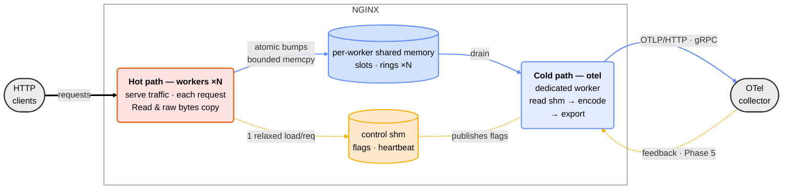

# ngx-otel-rust

A Rust dynamic [NGINX] module on the [`ngx-rust`] SDK that emits
OpenTelemetry signals to an OTel collector.  Designed for migration to
OTAP (OpenTelemetry Protocol with Apache Arrow) — the columnar evolution
of OTLP — in a later phase.

Everything it emits — metrics, logs, and traces — is defined in
**[`TELEMETRY_MODEL.md`](TELEMETRY_MODEL.md)**, the producer-side contract.
It uses OTel semantic-convention names and units.
See [Signals](#signals-what-this-module-emits).

[NGINX]: https://nginx.org/
[`ngx-rust`]: https://github.com/nginx/ngx-rust

## Status

**Phases 1–3 shipped: metrics, logs, and traces from a dedicated exporter
process; pre-upstream-PR.**

What this module emits:

- **Metrics** (Phase 1, on by default): lock-free, syscall-free per-worker
  counters on the request path; a dedicated exporter process aggregates and
  exports once per window. See [Windowed aggregation](#windowed-aggregation-and-scaling-characteristics) for how this keeps cost bounded as load grows.
- **Access logs + exemplars** (Phase 2, `otel_log_export on | if=<expr>`):
  a thin exception-tail of `LogRecord`s for operator-selected requests, plus
  trace-linked metric exemplars on the trace-sampling path. The bulk of traffic
  is represented by metrics; there is no per-request log. See
  [Signals](#signals-what-this-module-emits) and `TELEMETRY_MODEL.md` for
  the exemplar reservoir details.
- **Error logs** (Phase 2, `otel_error_log`): coalesced error `LogRecord`s with
  a companion error-rate counter.
- **Traces** (Phase 3, `otel_trace <expr>`): OTel server spans with W3C
  `traceparent` propagation, parent/ratio sampling, per-location span name and
  attributes, and `$otel_trace_id` / `$otel_parent_sampled` nginx variables.

Two production export transports (`otel_export_protocol`): **OTLP/HTTP** over
HTTP/1.1 (`otlp_http`, default) and **OTLP/gRPC** unary over HTTP/2 (`otlp_grpc`).
Both support `https://` (TLS); `http://` and `unix:` (OTLP/HTTP) are also
accepted. gRPC over `https://` negotiates HTTP/2 via ALPN `h2`.

**Performance (metrics-only build, 2026-05-22):** zero-cost-when-disabled
invariant verified at ≤ 0.01% throughput delta (module-loaded-but-disabled vs
no-module baseline) on isolated AWS EPYC and macOS arm64.  See
`tests/bench/RESULTS.md`. Validated by a **24-hour soak** (2026-05-29 → 30):
45.2 billion requests at ~523k req/s, bounded memory, and clean
collector-downtime recovery.

The README covers all shipped signals (metrics, logs, traces — Phases 1–3).
**NGINX Plus (Phase 4)** and **OTAP (Phase 5)** remain roadmap.  See the
Confluence proposal (link below) for the full phase plan.

## Highlights

**One module, the full OpenTelemetry picture — rich metrics, trace-linked exemplars,
operator-selected logs, and spans.** The signals reinforce each other: aggregate metrics
across the fleet, exemplars and logs to drill into the requests that matter, spans to
follow them across services.

- **Rich request metrics.** Per-request latency as a full distribution (microsecond
  precision), plus connection/request gauges and an optional per-status-class breakdown
  (2xx/4xx/5xx) you can toggle to trade detail for fewer metric series — covering every
  request, not a sampled subset.
- **Trace-linked exemplars.** Sampled requests carry a `trace_id` alongside their
  latency, so you pivot from a latency spike straight to a representative trace.
- **Selectable logs.** Log export is opt-in — you decide which requests become log
  records via an nginx `if=<expr>` over status, latency, or anything else.
  With nothing configured, no log records are emitted.
- **Distributed traces.** OTel server spans with W3C `traceparent` propagation and
  per-location span naming and attributes.

→ Full feature table and the exemplars-vs-exported-logs distinction:
**[`TELEMETRY_MODEL.md`](TELEMETRY_MODEL.md#feature-summary)**.

## Architecture

<!-- The diagram is a pipeline read left to right: requests enter on the left,
     telemetry exits on the right.  The two large rounded nodes ARE the architecture
     thesis — a hot path doing constant lock-free work on every request, and a cold
     path (one dedicated process) doing all wire-format work per interval, with shared
     memory (cylinders) as the only coupling between them.  Temperature colours: hot
     path = warm red (#e8590c — red-leaning on purpose, so it can't be confused with
     the amber control plane), cold path = blue.  The two lanes between them
     carry the two planes: telemetry (top, blue #648FFF) and control (bottom, amber
     #FFB000, dashed — the feedback half is Phase 5); user traffic is black (thick).
     LAYOUT NOTES (hard-won): hot/cold are NODES, not subgraphs — a band around a
     single node renders as clutter, and mermaid ignores a subgraph's `direction`
     when any internal node has an external edge; the flags edges point downstream
     (workers READ the control shm) so dagre ranks the macro flow correctly; NO
     `%%{init}%%` directive — third-party renderers (Zed's native preview, Typora)
     ignore or choke on it and it's deprecated upstream, so node text lines are
     kept short enough to fit mermaid's DEFAULT auto-wrap width (~200px) instead
     (it wraps regardless of <br/> breaks); no pure-white fills (clashes on dark
     backgrounds).  Zed's preview OVERRIDES all classDef colours with its editor
     theme's accents (`!important` CSS injection, by design — see zed
     crates/mermaid_render) — judge layout in Zed, but judge colours on
     GitHub/kroki. -->


*Read it left to right: requests enter on the left, telemetry leaves on the
right. The two large nodes are the design thesis — the **hot path** (warm red)
does constant, lock-free work on every request and never serialises; the
**cold path** (blue) is one dedicated process, spawned and respawned by the
nginx master, that does all wire-format work once per interval. Shared memory
(cylinders) is the only thing the two share: workers hold zero collector
sockets, and when a ring fills, telemetry drops — counted — while traffic is
untouched. On the hot path, REWRITE starts the span and parses any inbound
`traceparent` once; LOG bumps histograms and writes exemplars, tail records,
and the span end. Edge colours: **user traffic** black (thick) · **telemetry**
blue `#648FFF` · **control** amber `#FFB000`, dashed — the exporter publishes
flags that workers read with one relaxed atomic load per request; the
collector-side feedback half of that loop (and OTAP transport) is Phase 5.*

Instrumented metrics live in per-worker shared-memory counter slots.  A
Log-phase handler increments them atomically, and each worker writes only
to its own slot, so there is no cross-worker cache traffic.

A **dedicated `nginx: otel exporter` child process** owns the entire cold
path.  Its async export loop is driven by `ngx-rust`'s single-threaded
executor.  It reads the worker slots plus NGINX core's `ngx_stat_*`
atomics, encodes OTLP protobuf, and sends the result over either [hyper]
1.x HTTP/1 or OTLP/gRPC on HTTP/2.  Both transports run on a `NgxConnIo`
adapter, which wraps `ngx_peer_connection_t` and uses NGINX's own event
handlers for I/O-readiness wakeup — no spinning, no blocking.  Workers
never open a collector connection.

A small control shared-memory zone carries a liveness heartbeat plus a
flags word.  Workers load that flags word once per request — one `Relaxed`
atomic read, the sole hot-path branch, reserved for future dynamic
reconfiguration.

The `MetricSource` and `Encoder` trait boundaries, plus the
`ExportTransport` enum that dispatches between OTLP/HTTP and OTLP/gRPC,
keep an eventual OTAP / columnar migration an encoder swap rather than a
rewrite.

**Design principle: the worker copies raw facts and never encodes; all
wire-format work is cold-path.**  Workers do a bounded amount of
format-*independent* work; the exporter does everything format-specific.
On the request path a worker only *aggregates and defers*: a fixed set of
`Relaxed` atomic increments into its own shm histogram slots, plus — for
the sampled exception tail only — a single bounded, allocation-free copy
into its own ring.  That work is constant per request, lock-free, and
syscall-free, and its cost does not depend on the telemetry wire format.
Everything that *does* depend on the wire format — assembling OTel
records, OTLP protobuf encoding today, OTAP / columnar later — runs only
in the dedicated exporter on the cold path.  Because the data sits in
shared memory in a protocol-neutral shape, moving from OTLP to OTAP is an
encoder swap inside one cold-path process; it never reaches a worker or
the request path.

Three invariants follow.

1. **The request path does zero wire-format work.**  It copies raw facts —
   atomic bumps and bounded memcpys into shared memory — and never
   serialises.  Anything that shapes bytes for a wire format is pushed to
   the cold path.
2. **Read once, derive many.**  Each request datum is read once, at the
   phase that owns it: inbound trace context at the `rewrite` phase,
   parsed once and cached on the per-request context; the request outcome
   at the `log` phase, in one pass.  Every signal — metric, log, span —
   is derived from those captured reads.  No signal re-reads or re-scans
   a field another signal already read.
3. **"Zero wire-byte change" is the bar for refactoring telemetry code.**
   A change that leaves the emitted OTLP bytes byte-for-byte identical is
   a pure refactor, gated by the existing tests.  A change that alters
   them is a behaviour change, and is treated as such.

Invariants (1) and (2) govern *what a worker does* per request;
(3) governs *how we change the code that produces bytes*.

This one dedicated exporter is deliberately the **single cold path for all
three signals** — metrics (Phase 1), logs (Phase 2), and traces (Phase 3) —
so per-signal differences stay confined to the shared-memory shape while
one process owns all collector I/O.  The per-worker-export alternative (the model the production
C++ `nginx/nginx-otel` module uses: a background thread and its own connection
in every worker) was weighed across all three signals and declined; the
reasoning and the conditions that would reverse it are recorded in the design
proposal (Confluence link below).

When `otel_exporter` is not configured the Log-phase handler is not
registered and the exporter process is not spawned — no work runs on the
request path, no background process runs.  This is the
"zero-cost-when-disabled" invariant the module's upstream-acceptance
case rests on.

[hyper]: https://hyper.rs/

### Windowed aggregation and scaling characteristics

The exporter is a **windowed-aggregation engine at the edge**: each signal is
reduced over a time window before it leaves the process.  That is what keeps the
hot path cheap and the exported volume bounded as load grows.

- **Metrics** aggregate over the `otel_metric_interval` (a tumbling window):
  workers bump histogram/counter slots continuously; once per interval the
  exporter snapshots and emits one aggregated point per series.  The request path
  never serialises a metric.
- **Logs** are reduced over the drain window (250 ms): identical error templates
  **coalesce** into a single `LogRecord` carrying `coalesced_count`, paired with a
  companion rate metric, while the high-value exception tail rides a bounded
  reservoir.  A firehose of repeated errors becomes *count + representative
  sample* rather than N records — windowed reduction applied to logs.
- **Traces** batch over the same 250 ms drain window: spans accumulate in a
  per-worker ring and ship as one batch per window.

Because the reduction happens inside the window, the **two aggregated signals
(metrics and summary-logs) scale essentially for free** — more load raises the
per-window counts, not the number of exported records or the per-request cost.
That property is why they are default-on.

**Traces are the exception, and we measured it.**  A span is per-request
and cannot be aggregated, so it does not inherit the windowing win.  On a
single worker at 100% sampling, the exporter sustains roughly 10k spans
per second per worker; beyond that, the per-worker ring fills and excess
spans drop.  The drop is graceful — drop-on-full is cheap and request
latency is unaffected — and observable, counted by
`ngx_otel.traces.dropped_records`.  The ceiling is set by the per-drain
budget (at most 2,500 spans per worker drained every 250 ms), not by
exporter CPU, which sits around 2% at the ceiling.  That is a deliberate
sizing choice: raising the ceiling means enlarging the drain budget and
the ring together, and chunking the send to stay below the gRPC maximum
message size.  Practical guidance: metrics and summary-logs are cheap
enough to leave on by default; for high-volume tracing, sample down or
raise the trace buffers.  Measurements:
[`tests/bench/RESULTS-span-saturation-2026-06-09.md`](tests/bench/RESULTS-span-saturation-2026-06-09.md).

## Signals (what this module emits)

The full producer-side contract — every metric, log record, and trace,
with names, units, attributes, and temporality — lives in
**[`TELEMETRY_MODEL.md`](TELEMETRY_MODEL.md)**. That file is the source of truth for
building dashboards, alerts, or pipelines against this module; you do **not** need the
design proposal to integrate. In brief:

- **Metrics** (on by default): HTTP request duration as an OTel exponential
  histogram in seconds (HTTP semconv unit; ~13µs resolution). Emitted as two tiers:
  **Tier 1** (`http.server.request.duration`) — semconv-conformant, keyed on method,
  `http.response.status_class` (string `"1xx"`–`"5xx"`), and protocol;
  **Tier 2** (`nginx.http.request.duration.by_route` / `.by_upstream`) — nginx-specific
  breakdowns. Plus request/response body sizes; upstream timing histograms in
  seconds (`nginx.upstream.{response,header,connect}.duration`) and byte histograms
  (`nginx.upstream.bytes.{received,sent}`); the nginx `stub_status` series (see note
  below); and a `ngx_otel.error_log.events` error-rate counter. Histograms and Sums
  use cumulative temporality; Gauges (connection-state series, `export_interval` in
  `s`, `exporter.restarts`, and the TLS certificate gauges) are instantaneous and
  carry no temporality.
- **Logs — access** (`otel_log_export on | if=<expr>`): metrics-primary, plus a
  **thin exception tail** of `LogRecord`s for operator-selected requests. Not a
  per-request log. Metric **exemplars** (trace-linked) are emitted separately on
  the trace-sampling path (`otel_trace`): up to two uniformly-sampled exemplars
  per data point per export cycle (a small fixed reservoir, reset each cycle).
  See `TELEMETRY_MODEL.md` for the full exemplar contract.
- **Logs — error** (`otel_error_log [level]`): coalesced `nginx.error` `LogRecord`s
  (one sample + count per template) with a companion error-rate metric.
- **Traces** (`otel_trace <expr>` per location): OTel server spans. W3C
  `traceparent` propagation (`otel_trace_context`); parent-based or ratio
  sampling; per-location span name + custom attrs; `$otel_trace_id` /
  `$otel_parent_sampled` nginx variables. Exemplars on the duration histogram
  carry `trace_id` and `span_id` from the module's own spans, completing the
  drill-down from a metric, through its exemplar, to the Tempo trace.
- **Exporter self-metrics**: `ngx_otel.dropped_records`, `ngx_otel.send_failures`,
  `ngx_otel.logs.access.dropped_records`, `ngx_otel.logs.error.dropped_records`,
  `ngx_otel.logs.error.coalesced_orphaned_records`, `ngx_otel.logs.send_failures`,
  `ngx_otel.traces.dropped_records`, `ngx_otel.bidi_backpressure_drops`,
  `ngx_otel.export_interval`, `ngx_otel.exporter.restarts`,
  `ngx_otel.delivery.permanent_rejected`, `ngx_otel.delivery.partial_rejected`,
  `ngx_otel.delivery.unauthorized`. See
  `TELEMETRY_MODEL.md` § "Exporter self-observability metrics".
- **Serving-certificate metrics** (requires nginx built with
  `--with-http_ssl_module` — the default `make build` includes it):
  `ngx_otel.tls.certificate.not_after`, `ngx_otel.tls.certificate.not_before`,
  `ngx_otel.tls.certificate.time_to_expiration` — three gauges per TLS serving
  certificate, collected at startup/reload from what nginx actually **serves**
  (a renewed file on disk changes nothing until reload);
  `time_to_expiration` goes negative after expiry. Absent entirely when nginx
  lacks the ssl module or no `ssl_certificate` is configured. See
  `TELEMETRY_MODEL.md` § "Serving-certificate metrics".
- **Collector-certificate gauge** (TLS endpoints only):
  `ngx_otel.tls.collector_cert.not_after` — one Gauge (`s`, int64 epoch) for
  the `notAfter` of the certificate the OTLP collector presents during TLS
  handshake. Attribute: `server.address` = collector hostname. **Absent** for
  plaintext endpoints or before the first successful handshake. Useful for
  alerting when the collector's own certificate is about to expire. See
  `TELEMETRY_MODEL.md` § "Collector-certificate gauge".

A ready-made Grafana dashboard is provided at
[`test-harness/demo/grafana/dashboards/ngx-otel-rust-overview.json`](test-harness/demo/grafana/dashboards/ngx-otel-rust-overview.json).

### Demo: TLS end-to-end

`test-harness/demo/run-demo.sh up` starts the full stack with TLS enabled by
default (`DEMO_TLS=1`).  At startup the script mints a per-run self-signed CA
(`demo-ca.crt`) and a collector server certificate signed by that CA with an IP
SAN of `127.0.0.1`; the OTLP collector container loads the cert and requires TLS
on both gRPC (port 14317) and HTTP (port 14318) receivers.  The nginx exporter is
configured with `trusted_certificate <demo-ca.crt>` and `endpoint
https://127.0.0.1:14317`, so every export batch is encrypted and the
collector's certificate is verified by the demo CA (exercising the IP-literal
verification path — `X509_VERIFY_PARAM_set1_ip_asc` — rather than the DNS-name
path).

The fail-closed behaviour is demonstrable: run `./run-demo.sh down`, then start
nginx manually pointing `trusted_certificate` at a wrong CA file — the exporter
will produce send-failure alerts in `error.log` and deliver no data.  Restoring
the correct CA (via SIGHUP or restart) brings telemetry flowing again.  Use
`DEMO_TLS=0 ./run-demo.sh up` for the plaintext (`http://`) profile.

## Getting Started

### Requirements

- NGINX sources, 1.22.0 or later, as a sibling checkout at `../nginx`
  (override with `NGINX_SOURCE_DIR`). The module is currently developed and
  tested against **nginx 1.31.1**; any `1.22.0+` release built `--with-compat`
  should work. Match the version (and any API-changing patches) to what you
  plan to deploy.
- The **patched `ngx-rust` fork** as a sibling checkout at `../ngx-rust`:
  ```sh
  git clone -b ngx-otel-rust-deadlock-fix git@github.com:CVanF5/ngx-rust.git
  ```
  `Cargo.toml` path-pins `../ngx-rust` (it does **not** use the upstream
  `nginx/ngx-rust` crate). That branch carries changes this module needs and
  that are not yet upstream, so building against stock `ngx-rust` will fail with
  missing symbols: the `ngx_post_event` deadlock/Waker fix, and the `nginx-sys`
  bindgen additions the dedicated exporter relies on — the `ngx_channel.h`
  inter-process-channel bindings (`ngx_channel_t`, `ngx_add_channel_event`,
  `NGX_CMD_QUIT`/`TERMINATE`/`REOPEN`) and the `NGX_RS_READ_EVENT` /
  `NGX_RS_WRITE_EVENT` constants. (Tracking upstream via `ngx-rust` PR #295; drop
  the fork once it lands.)
- Regular NGINX build dependencies: C compiler, `make`, PCRE2, Zlib.
- System-wide installation of OpenSSL 1.1.1 or later.
- Rust toolchain (1.85.0 or later — the `ngx-rust` dependency is
  edition 2024 / MSRV 1.85).
- `pkg-config` or `pkgconf`.
- `libclang` for rust-bindgen (used by `nginx-sys` and `openssl-sys` to
  parse C headers at build time).
- `protoc` (Protocol Buffers compiler) for `prost-build` to compile
  the vendored OTel `.proto` files in `proto/`.
- Optional: Docker, for the local OTel collector the integration
  tests use.  Without Docker, point any OTLP/HTTP receiver at
  `127.0.0.1:4318` and the tests will work against it.

The NGINX and its dependency versions should match the ones you plan to
deploy, including any patches that change the API.

#### Platform setup

**Debian / Ubuntu:**

```sh
sudo apt update
sudo apt install -y \
    libclang-dev \
    libssl-dev \
    libpcre2-dev \
    zlib1g-dev \
    pkg-config \
    build-essential \
    protobuf-compiler
# Optional: Docker for the local OTel collector
sudo apt install -y docker.io docker-compose-plugin
```

Then install Rust via [rustup](https://rustup.rs/) if you don't have
it already; the system `rustc` package on Debian stable tends to lag
the MSRV.

**macOS (Homebrew):**

```sh
# Xcode command-line tools (provides clang, make, libc headers, libclang)
xcode-select --install

brew install \
    openssl@3 \
    pcre2 \
    pkg-config \
    protobuf

# Optional: Docker Desktop (or OrbStack / Colima) for the OTel collector
brew install --cask docker
```

Then install Rust via [rustup](https://rustup.rs/).  macOS already
ships Zlib in the base system, and Xcode's CLI tools provide
`libclang` — no separate package needed.

> [!TIP]
> The module built against a specific release of unmodified NGINX Open
> Source with `--with-compat` is compatible with a corresponding
> release of NGINX Plus.  Refer to F5's guidance on
> [compiling dynamic modules for NGINX Plus][nginx-plus-modules].

[nginx-plus-modules]: https://www.f5.com/company/blog/nginx/compiling-dynamic-modules-nginx-plus

### Building

There are two supported build paths.  Both produce a working loadable
module; the first is the **canonical** path expected by NGINX upstream
review and what the project's automated test targets drive.

#### Canonical path (recommended): NGINX autoconf via Makefile

```sh
# Requires sibling checkouts: ../nginx (override via NGINX_SOURCE_DIR) and
# ../ngx-rust on branch ngx-otel-rust-deadlock-fix (the patched fork; see Requirements).
cd ngx-otel-rust
make build              # debug (default); produces objs-debug/
# or
make build-release      # produces objs-release/
# or
make build-sanitize     # ASan; opt-in
```

Produces:

- `objs-<flavor>/nginx` — a fresh NGINX binary linked against this
  module.  Used by the integration tests.
- `objs-<flavor>/ngx_http_otel_module.so` — the loadable module.

> **`--with-http_stub_status_module` and the `nginx.connections.*` /
> `nginx.requests.total` metrics.** Those seven series read nginx's internal
> `ngx_stat_*` globals, which only exist when nginx is built with
> `--with-http_stub_status_module` (the default build above includes it).
> Two consequences if your nginx differs:
>
> - **Module built against a nginx *without* the flag** — the stub_status
>   metric source is compiled out and not registered; the seven series are
>   **absent** from the export (not present-as-zero), and the exporter logs a
>   one-shot `[warn]` at startup naming the missing flag. Every other signal
>   works normally.
> - **A stub-enabled module loaded into a *no-flag* nginx** — this combination
>   is rejected at config-test time: `nginx -t` fails with
>   `[emerg] dlopen() ... undefined symbol: ngx_stat_<...>` because the
>   `ngx_stat_*` symbols the module references are not present in that nginx.
>   Build the module against headers from the same nginx you will load it into.

> **`nginx.connections.accepted`, `nginx.connections.handled`, and
> `nginx.requests.total` are emitted as OTLP Sums** (monotonic, Cumulative —
> real counters). A Prometheus remote-write backend exposes them as
> `nginx_requests_total` (etc.) with no `_sum` suffix. The connection-state
> series — `nginx.connections.active`, `.reading`, `.writing`, `.waiting` —
> are real OTLP Gauges (instantaneous, no start time).

> **`--with-http_ssl_module` and the `ngx_otel.tls.certificate.*` metrics.**
> The serving-certificate gauges (`not_after` / `not_before` /
> `time_to_expiration`) require nginx built with `--with-http_ssl_module`
> (the default build above includes it). When the module runs in a nginx
> built **without** the ssl module, it still loads and serves: the three
> series are **absent** from the export (not present-as-zero) and one
> config-time NOTICE (`cert metrics unavailable: nginx built without
> http_ssl_module`) explains why. Every other signal works normally.

Internals: `make build` invokes
`./auto/configure --add-dynamic-module=$(CURDIR) --with-compat --with-http_ssl_module --with-http_stub_status_module`
against `$(NGINX_SOURCE_DIR)`, which sources our `config` script,
which in turn loads `auto/rust` from this tree.  `auto/rust` then
adds a Makefile target that calls `cargo rustc --crate-type staticlib
--no-default-features` to produce `libngx_http_otel_module.a`, which
NGINX's generated Makefile links into the `.so`.

Overrides:

- `NGINX_SOURCE_DIR=/path/to/nginx make build` — point at a specific
  NGINX checkout.
- `BUILD=release make build` — same as `make build-release`.
- `NGX_CARGO=cargo-1.82 make build` — pin a specific cargo binary.

#### Prototyping path: direct `cargo build`

```sh
export NGINX_SOURCE_DIR=$(realpath ../nginx)
export NGINX_BUILD_DIR=$(realpath ../nginx/objs)
cd ngx-otel-rust
cargo build --release
```

Produces `target/release/libngx_http_otel_module.{dylib,so}` (cdylib).
This path is faster to iterate on, omits NGINX's Makefile re-link
step, and is what the existing bash integration scripts (under
`tests/integration/`) currently load.

> **macOS caveat:** the canonical `make` path auto-pins `openssl-sys` to the
> same OpenSSL nginx links (`OPENSSL_DIR=/opt/homebrew/opt/openssl@3
> OPENSSL_STATIC=0 OPENSSL_NO_VENDOR=1` on Darwin). The bare `cargo build`
> above does **not**, so on macOS export those same vars before building —
> otherwise the module statically embeds a different OpenSSL than nginx's,
> giving two OpenSSL runtimes in one process and wrong `SSL_CTX` struct
> layouts (cert metrics silently read zero certs). See
> [`OPENSSL_SUPPORT.md`](OPENSSL_SUPPORT.md). The `make` path is unaffected.

The `export-modules` cargo feature (on by default) injects the
`ngx_modules` table the cdylib needs when built outside NGINX's
autoconf system.  The canonical autoconf path passes
`--no-default-features` and lets NGINX's `auto/module` generate the
entry instead.

### Configuration directives

All directives are valid in the `http {}` context.  Example:

```nginx
load_module modules/ngx_http_otel_module.so;

http {
    otel_exporter {
        endpoint http://127.0.0.1:4318;   # OTLP/HTTP: base URL; /v1/{metrics,logs,traces} appended per signal
        # endpoint https://collector.example.com:4317; # OTLP/HTTP over TLS (default port 443)
        # endpoint http://127.0.0.1:4317; # OTLP/gRPC: host:port only (path N/A for gRPC)
        # endpoint unix:/run/otel-collector.sock;   # Unix socket (base path "/"; signals appended)

        # TLS options (apply when endpoint uses https://):
        # trusted_certificate /etc/ssl/certs/ca-bundle.pem;  # CA bundle; default = system trust store
        # ssl_certificate     /etc/nginx/certs/client.crt;   # mTLS client cert
        # ssl_certificate_key /etc/nginx/certs/client.key;   # mTLS client private key
        # ssl_verify          on;                             # on (default) | off — off disables cert verification (INSECURE)

        # Per-signal overrides (optional; used as-is, no path appended):
        # metrics_endpoint http://metrics-host:4318/v1/metrics;
        # logs_endpoint    http://logs-host:4318/v1/logs;
        # traces_endpoint  http://traces-host:4318/v1/traces;
    }
    otel_export_protocol otlp_grpc;         # otlp_http (default) | otlp_grpc
    otel_service_name my-nginx;
    otel_resource_attr deployment.environment production;
    otel_exporter_header authorization "Bearer ...";
    otel_metric_interval 10s;
    otel_metric_zone otel_metrics 1m;
    otel_metric_status_code_class on;       # emit method × status-class × protocol attrs on the duration series (live)

    # Logs (off unless these are set; orthogonal to nginx's own access_log/error_log):
    # otel_log_export is per-location/server (see server block below) — select which
    # requests get an exception-tail LogRecord. Exemplars ride otel_trace, not this.
    # otel_log_ring_size 512k;              # per-worker logs ring capacity (exception-tail substrate)
    otel_error_log;                         # enable error-log export; floor defaults to `error`. e.g. `otel_error_log warn;`
    # otel_error_log_coalesce off;          # default on; off = best-effort verbatim streaming (lossy under load — see TELEMETRY_MODEL.md)

    # url.path + user_agent.original ride on the exception-tail LogRecord
    # (when otel_log_export selects a request), never as metric dimensions.

    server {
        # Traces (Phase 3): per-location / per-server control.
        # otel_trace, otel_trace_context, otel_span_name, otel_span_attr are
        # valid in http, server, and location blocks; inner location wins.
        otel_trace on;                      # complex value: literal / $var / split_clients
        otel_trace_context propagate;       # ignore | extract (default) | inject | propagate
        otel_log_export on;                 # exception-tail export: on | off | if=<expr>; valid http/server/location

        location /api {
            otel_span_name "API $request_method"; # per-location span name override
            otel_span_attr deployment.environment production; # custom span attribute

            proxy_pass http://backend;
        }

        location /healthz {
            # Health checks: disable tracing entirely (zero cost).
            otel_trace off;
            return 200 "ok\n";
        }
    }
}
```

Notes:

- When `otel_exporter` is not configured the module is completely inert
  (see the [zero-cost-when-disabled invariant](#architecture) and
  `tests/bench/RESULTS.md`).
- `endpoint` is the **base** URL.  For OTLP/HTTP the module appends
  `/v1/metrics`, `/v1/logs`, `/v1/traces` to the base automatically
  (OTel spec behaviour for `OTEL_EXPORTER_OTLP_ENDPOINT`).
  Optional per-signal overrides (`metrics_endpoint`, `logs_endpoint`,
  `traces_endpoint`) inside `otel_exporter {}` are used as-is (no path
  appended), matching `OTEL_EXPORTER_OTLP_{SIGNAL}_ENDPOINT`.
  For OTLP/gRPC, `endpoint` is `host:port` only; path is irrelevant
  (routing is by gRPC service method).
- `otel_export_protocol` selects the export wire protocol: `otlp_http`
  (default, OTLP/HTTP over HTTP/1.1) or `otlp_grpc` (OTLP/gRPC unary over
  HTTP/2).  The example above uses gRPC; omit the directive for HTTP.
- All export work runs in the dedicated `nginx: otel exporter` process;
  workers serve traffic and bump shm counters only.
- Counters reset on `nginx -s reload`; downstream collectors handle
  continuity via OTLP's `start_time_unix_nano`.

#### TLS directive reference

TLS options are set inside `otel_exporter {}` and take effect when
`endpoint` uses the `https://` scheme.  They have no effect for `http://`
or `unix:` endpoints.

| Directive                  | Context          | Default                    | Description                                                                              |
|----------------------------|------------------|----------------------------|------------------------------------------------------------------------------------------|
| `trusted_certificate <path>` | `otel_exporter` | System trust store         | CA bundle for validating the collector's server certificate. Absolute path to a PEM file (single CA or chain). When omitted, `SSL_CTX_set_default_verify_paths` loads the OS default trust store. |
| `ssl_certificate <path>`   | `otel_exporter`  | (none — mTLS disabled)     | Client certificate chain for mTLS. PEM file. Must be set together with `ssl_certificate_key`. |
| `ssl_certificate_key <path>` | `otel_exporter` | (none — mTLS disabled)     | Client private key for mTLS. PEM file. Must be set together with `ssl_certificate`. |
| `ssl_verify on\|off`       | `otel_exporter`  | `on`                       | `off` disables collector certificate verification. **INSECURE — for testing only.** Emits a config-time WARN when set to `off`. |

Key behaviours:

- **Server cert verification** is enforced by default: the exporter validates
  the collector's certificate against `trusted_certificate` (or the system
  store) and checks hostname / IP-SAN against the endpoint host. A mismatch
  causes a TLS handshake failure, `send_failed` error-log alerts, and retry
  backoff — zero data is delivered and nginx continues serving normally.
- **Hostname verification**: DNS-name endpoints use `X509_VERIFY_PARAM_set1_host`
  (matches the cert's DNS SAN); IP-literal endpoints (e.g. `https://127.0.0.1:4317`)
  use `X509_VERIFY_PARAM_set1_ip_asc` (matches the cert's iPAddress SAN).
- **mTLS**: set both `ssl_certificate` and `ssl_certificate_key` together.
  Setting only one is a config-time error. When not set, no client certificate
  is presented (plain server-auth TLS).
- **SIGHUP reload**: the new exporter generation spawned after a reload reads
  the current `trusted_certificate`, `ssl_certificate`, and `ssl_certificate_key`
  paths — cert/CA rotation takes effect at reload time.
- **gRPC over TLS**: when `endpoint` is `https://` and `otel_export_protocol
  otlp_grpc` is set, the gRPC transport negotiates `h2` via ALPN automatically.
  No extra configuration is needed.
- **Minimum OpenSSL version**: 1.1.1 (API `X509_VERIFY_PARAM_set1_host` and
  `set1_ip_asc` first available in 1.0.2; 1.1.1+ recommended). See
  [`OPENSSL_SUPPORT.md`](OPENSSL_SUPPORT.md) for the full support matrix.

### Running tests

```sh
make check       # rustfmt + clippy (zero warnings required)
make unittest    # cargo test --lib (library unit tests, debug profile)
make test        # bash integration scripts (see below)
make all         # build + check + test
```

Race and memory-safety detection run the integration scripts under
**ThreadSanitizer** and **AddressSanitizer** (Linux arm64, dockerized).
Results are committed as evidence (`tests/RESULTS-{tsan,asan}-*.txt`):

```sh
make tsan-test        # full TSAN suite (all integration scripts under TSAN)
make tsan-test-dns    # DNS / dual-stack resolver+connect path only
make tsan-test-error  # error-log path only (writer → ring → drain)
make asan-test        # ASan use-after-free gate (executor wake/teardown paths)
```

The path-scoped gates (`-dns`, `-error`) exist because some scripts are
timing-flaky inside the combined suite under TSAN's slowdown; running a
single path in isolation gives a clean race signal.

`make test` requires a running OTel collector on `127.0.0.1:4318`
(OTLP/HTTP) and `127.0.0.1:4317` (OTLP/gRPC).  Start (and stop) the
project's collector with:

```sh
make collector-up      # start the local OTel collector container (idempotent)
make collector-status  # show its status
make collector-down    # stop it
```

The integration scripts assert against metrics that arrive at the
collector, so any OTLP receiver will work.  In development the project
uses an `otel/opentelemetry-collector-contrib:0.152.0` Docker container
with HTTP + gRPC receivers and debug + file exporters.

Direct bash invocation (for debugging a specific test):

```sh
export NGINX_SOURCE_DIR=/path/to/nginx \
       NGINX_BUILD_DIR=/path/to/nginx/objs
bash tests/integration/run.sh                        # metrics arrive end-to-end (OTLP/HTTP)
bash tests/integration/run_reload.sh                 # SIGHUP reload + counter-reset
bash tests/integration/run_grpc_export.sh            # production OTLP/gRPC export path
bash tests/integration/run_access_log.sh             # access exception tail + exemplars
bash tests/integration/run_error_log.sh              # coalesced error log + rate metric
bash tests/bench/zero_cost.sh                        # zero-cost-when-disabled (~10 min)
bash tests/bench/analyse.sh                          # re-derive tolerance check from JSON
```

There are 36 `run_*.sh` scripts in `tests/integration/` covering reload, endpoint changes, gRPC variants, exporter lifecycle, crash-respawn, DNS/IPv6, TLS, signal handling, and more.
Run any script directly with `bash tests/integration/run_<name>.sh`; see the `tests/integration/` directory for the full set.

The bash integration scripts are due to be ported to Perl
[`Test::Nginx`] (see [Project layout](#project-layout) below); after that
`make test` will drive `prove -I $(NGINX_TESTS_DIR)/lib t/`.  The load-driver
scripts (`tests/bench/*.sh`) stay bash — Test::Nginx isn't a good fit
for `wrk`-driven benchmarks.

[`Test::Nginx`]: https://github.com/openresty/test-nginx

### Build options

The module currently exposes no `cargo` features for runtime behaviour.
The build-time knobs are:

| Variable / flag       | Purpose                                            | Default          |
|-----------------------|----------------------------------------------------|------------------|
| `NGINX_SOURCE_DIR`    | Path to the NGINX source checkout                  | `../nginx`       |
| `NGINX_BUILD_DIR`     | Path to NGINX's `objs/` (or `objs-<flavor>/`)      | `$(CURDIR)/objs-$(BUILD)` |
| `BUILD`               | `debug` \| `release` \| `sanitize`                 | `debug`          |
| `TEST_PREREQ`         | Set empty to skip building before `make test`      | `build`          |
| `NGX_CARGO`           | Cargo binary                                       | `cargo`          |
| `NGX_RUST_TARGET`     | `--target` for `cargo rustc` (cross-compile)       | (host)           |
| Cargo feature `test-support` | Exposes `Spin*` test transports for unit tests  | off              |

## Developing

### Directory layout

```
../ngx-rust/   ← patched ngx-rust fork (branch ngx-otel-rust-deadlock-fix)
../nginx/      ← NGINX source checkout
ngx-otel-rust/ ← this repo
```

The Makefile defaults (`NGINX_SOURCE_DIR=../nginx`) and `.cargo/config.toml`
both expect sibling checkouts at these paths.  Override via env vars if your
layout differs.

### First-time setup

```sh
# 1. Build nginx + debug module once (populates objs-debug/ and target/debug/).
make build

# 2. After that, rust-analyzer and bare `cargo check` / `cargo test` work
#    without going through make, because .cargo/config.toml supplies the
#    NGINX_SOURCE_DIR and NGINX_BUILD_DIR defaults automatically.
```

`.cargo/config.toml` contains `[env]` defaults pointing to the debug tree
(`NGINX_BUILD_DIR = "objs-debug"`).  These defaults do NOT override variables
already set in the environment, so Makefile targets and CI always win.

### Canonical test commands

```sh
make check             # rustfmt + clippy (zero warnings required)
make unittest          # cargo test --lib  (debug profile, objs-debug tree)
make unittest-release  # cargo test --release --lib  (release profile, objs-release tree)
make test              # bash integration suite (pins BUILD=release; see note below)
```

`make unittest-release` requires `make build-release` to have been run first
(to populate `objs-release/`).

`make test` always pins `BUILD=release` so the nginx binary, `NGINX_BUILD_DIR`, and the
cargo `--release` artifact are all from the same release pairing (production-identical).
For a debug-pairing integration run (e.g. to exercise nginx debug assertions), use
`BUILD=debug make test` — but note this writes a release-profile `nginx-sys` artifact
to `target/release` built against the debug nginx tree, which poisons the cache for the
next `make build-release`; run `cargo clean` before `make build-release` afterward (the
build-flavor guard will flag the mismatch if you forget).

### Build-flavor guard

A build-time guard in `build.rs` enforces that the cargo profile and the nginx
tree flavor agree:

- **release profile + `--with-debug` nginx tree → hard error** (names the
  remedy).  This is the hazard that `.cargo/config.toml`'s `objs-debug`
  default creates: bare `cargo test --release --lib` is blocked.  Use
  `make unittest-release` instead.
- **debug profile + non-debug nginx tree → warning only** (unusual; tests still
  work, just without nginx's debug assertions).

Escape hatch (intentional cross-link): set `NGX_OTEL_ALLOW_FLAVOR_MISMATCH=1`.
Run `cargo clean` afterward to purge the stale release cache.

## Project layout

```
ngx-otel-rust/
├── auto/rust              # vendored ngx-rust shell library for autoconf integration
├── build/                 # per-flavor make includes (debug, release, sanitize, compat-*)
├── config                 # NGINX module config (sourced by auto/configure)
├── config.make            # NGINX module Makefile fragment
├── Makefile               # top-level entry: build / check / test / unittest
├── Cargo.toml
├── build.rs               # NGINX feature detection, prost-build for proto files
├── proto/                 # vendored OpenTelemetry proto sources: common, resource,
│                          # metrics, logs, trace + their collector service protos
│                          # (metrics/logs/trace _service); echo/ for the gRPC bidi smoke
├── src/
│   ├── lib.rs             # module declaration, init_process, exit_process, zero-cost-when-disabled invariant
│   ├── config.rs          # directives, MainConfig, old_config accessor for SIGHUP reload
│   ├── shm.rs             # per-worker shm slot setup, atomic increment helpers
│   ├── data_model/        # OTel-abstract types (Histogram / Sum / Gauge variants)
│   ├── metric_source/     # MetricSource trait + StubStatusSource + InstrumentedSource
│   ├── encoder/           # Encoder trait + OTLP/HTTP protobuf encoder
│   ├── transport/         # Transport trait; hyper_http.rs (OTLP/HTTP async),
│   │                      # grpc/ (OTLP/gRPC unary production transport + bidi
│   │                      # smoke harnesses on a runtime-less h2 executor)
│   ├── exporter/          # dedicated "nginx: otel exporter" process: control_shm
│   │                      # (flags + heartbeat), worker->exporter channel
│   ├── export/            # export loop, graceful drain, retry buffer,
│   │                      # SelfMetricsSource (13 self-metrics incl. exporter.restarts)
│   ├── traces/            # span instrumentation, W3C traceparent, sampling
│   ├── logs/              # access and error log record assembly
│   ├── processor/         # exporter-pipeline Processor (drain→process→encode; e.g. probe_drop span filter)
│   ├── shim/              # C shims for nginx struct fields (bindgen workarounds)
│   ├── cert_table.rs      # TLS certificate table (serving-cert + collector-cert gauges)
│   ├── liveness.rs        # liveness helpers for the exporter process
│   └── util.rs            # shared utilities
├── tests/
│   ├── transport_integration.rs  # async transport integration test (test-support feature)
│   ├── transport_errors.rs       # error-path coverage
│   ├── integration/              # end-to-end bash scripts (pending Test::Nginx port)
│   │   ├── nginx.conf
│   │   ├── run.sh                # baseline: metrics arrive end-to-end
│   │   ├── run_reload.sh         # SIGHUP reload, exit_process flush, counter-reset
│   │   ├── run_endpoint_change.sh # endpoint swap across reload
│   │   ├── run_grpc_*.sh         # gRPC smoke / bidi / overload + production export
│   │   └── run_exporter_*.sh     # exporter lifecycle, crash-respawn, reload-overlap, heartbeat
│   └── bench/
│       ├── nginx_c1.conf         # no module loaded
│       ├── nginx_c2.conf         # module loaded, no exporter (zero-cost case)
│       ├── nginx_c3.conf         # module loaded + exporter configured
│       ├── zero_cost.sh          # zero-cost wrk benchmark harness, randomised iteration order
│       ├── analyse.sh            # tolerance assertion against committed JSON results
│       └── RESULTS.md            # zero-cost + soak results (isolated AWS EPYC + macOS arm64)
└── ...
```

## Limitations

- **At-least-once delivery on retry.**  A send failure after the collector
  already ingested a batch causes that batch to be re-sent.  Metrics are
  effectively idempotent (cumulative snapshots); log and span duplicates are
  possible and require collector-side dedup.  See [Delivery semantics in
  `TELEMETRY_MODEL.md`](TELEMETRY_MODEL.md#delivery-semantics).
- **Gen-1 exporter is unsupervised under `daemon on`.**  With `daemon on`
  (the nginx production default) the gen-1 exporter is orphaned to init
  after the daemonize double-fork; nginx cannot see its SIGCHLD and will
  not respawn it.  Run `nginx -s reload` once after startup to restore
  supervision (gen-2 onward is fully supervised).  The module logs an
  `[alert]` at startup to remind you.  See
  [LIFECYCLE.md §"Known limitation: gen-1 exporter under daemon on"](LIFECYCLE.md)
  for the full explanation and the deferred self-supervisor design.
- **Hot path is single-process-per-worker**; per-histogram attribute
  populations are reserved for a later iteration that needs
  multi-dimensional shm.
- **Tokio appears in `Cargo.lock`** transitively via hyper 1.x.  It is
  present at the type level but never instantiated at runtime — the
  module's "no Tokio" rule reads as "no Tokio runtime use".  See the
  design proposal (Confluence link below) for the architectural rationale.

## Related

- F5-internal design proposal (Confluence):
  *Proposal: a high-performance observability module for NGINX (ngx-otel-rust)*
  <https://docs.f5net.com/spaces/~vandesande/pages/1241830506>
- C++ precedent: [`nginx/nginx-otel`](https://github.com/nginx/nginx-otel)
  (traces only).  Same directive vocabulary, different concurrency
  model (this module uses ngx-rust's event-loop executor, not a
  per-worker `std::thread` running `grpc++`).
- ACME module precedent: [`nginx/nginx-acme`](https://github.com/nginx/nginx-acme).
  This project's build-system shape (Makefile + `config` + `auto/rust`
  + `build/*.mk`) was migrated to match nginx-acme's; see commits
  `6f3133b`, `fdd521c`, `4555185` for the migration.
- OTAP / Arrow project: [`open-telemetry/otel-arrow`](https://github.com/open-telemetry/otel-arrow).
  Phase 5 target for the columnar encoder swap.

## License

Apache-2.0.  See [`LICENSE`](LICENSE).
