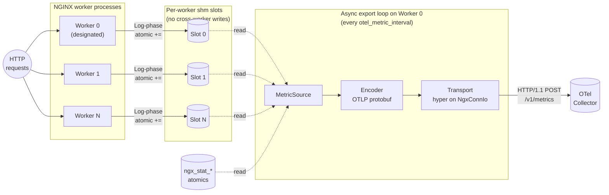

# ngx-otel-rust

A Rust dynamic [NGINX] module on the [`ngx-rust`] SDK that emits
OpenTelemetry signals to an OTel collector.  Designed for migration to
OTAP (OpenTelemetry Protocol with Apache Arrow) — the columnar evolution
of OTLP — in a later phase.

[NGINX]: https://nginx.org/
[`ngx-rust`]: https://github.com/nginx/ngx-rust

## Status

**Phase 1.1 (OTLP/HTTP metrics) is in active development; pre-PR.**

What works today:

- Per-worker shm counter slots written from a Log-phase handler — no
  allocations, no locks, no syscalls on the request path.
- Worker-0-only async export loop driving hyper-on-`ngx-rust` HTTP/1
  (no Tokio runtime).
- Stub-status equivalents (`nginx.connections.*`, `nginx.requests.total`)
  plus a histogram set inspired by F5 AVR
  (`http.server.request.duration`, request/response body size, upstream
  timings, upstream byte counts).
- OTLP protobuf encoding with vendored proto files; collector receives
  the expected Sum / Gauge / Histogram shapes.
- Graceful drain on `nginx -s quit` via async + `exit_process`
  synchronous flush (closes the cancelable-timer race during sleep).
  Supports `http://` and `unix:` endpoints; `https://` deferred to
  Phase 1.2.
- SIGHUP reload safety (`old_config()` accessor, clean worker-generation
  transition, endpoint-change supported).
- Zero-cost-when-disabled invariant verified statistically:
  `< 0.5%` delta on median latency / p99 / throughput vs a no-module
  baseline at ~56,500 req/s on a dev laptop.  Production-shape numbers
  pending Step 12 on representative hardware.

What's pending in Phase 1.1:

- Step 12 stress + acceptance test suite — 10-minute sustained load
  with bounded memory growth, collector-downtime injection via
  `docker stop` (drops accounted via `ngx_otel.dropped_records`
  self-metric), a 24-hour soak harness, and a sweep of the Phase 1.1
  acceptance criteria.  Tracked in F5-internal development notes;
  not on this repo's roadmap until after Phase B (Test::Nginx
  migration) lands.

Phase 1.2 onward (logs, traces, NGINX Plus, OTAP) is out of scope here.
See the Confluence proposal (link below) for the full phase plan.

## Architecture



Per-worker shm counter slots for instrumented metrics; atomic increments
from a Log-phase handler write to the worker's own slot only (no
cross-worker cache traffic).  Worker 0 runs the only export loop —
async, driven by `ngx-rust`'s single-threaded executor — which reads
slots plus NGINX core's `ngx_stat_*` atomics, encodes via OTLP protobuf,
and sends via [hyper] 1.x driven on a `NgxConnIo` adapter that wraps
`ngx_peer_connection_t` and uses NGINX's event handlers for I/O
readiness wakeup (no spinning, no blocking).  Three trait boundaries —
`MetricSource`, `Encoder`, `Transport` — keep an eventual OTAP /
columnar migration a swap, not a rewrite.

When `otel_exporter` is not configured the Log-phase handler is not
registered and the export task is not spawned — no work runs on the
request path, no background task runs in any worker.  This is the
"zero-cost-when-disabled" invariant the module's upstream-acceptance
case rests on.

[hyper]: https://hyper.rs/

## Getting Started

### Requirements

- NGINX sources, 1.22.0 or later (1.26.x recommended).
- Regular NGINX build dependencies: C compiler, `make`, PCRE2, Zlib.
- System-wide installation of OpenSSL 1.1.1 or later.
- Rust toolchain (1.81.0 or later).
- `pkg-config` or `pkgconf`.
- `libclang` for rust-bindgen.
- Optional: a running OTel collector reachable at
  `127.0.0.1:4318` (OTLP/HTTP).  The integration tests assert against
  metrics arriving at the collector, so any OTLP/HTTP receiver works.
  A typical local setup is `otel/opentelemetry-collector-contrib` in
  Docker with an `otlp/http` receiver and a `debug` or `file`
  exporter.

The NGINX and its dependency versions should match the ones you plan to
deploy, including any patches that change the API.

> [!TIP]
> The module built against a specific release of unmodified NGINX Open
> Source with `--with-compat` is compatible with a corresponding
> release of NGINX Plus.  Refer to F5's guidance on
> [compiling dynamic modules for NGINX Plus][nginx-plus-modules].

[nginx-plus-modules]: https://www.f5.com/company/blog/nginx/compiling-dynamic-modules-nginx-plus

### Building

There are two supported build paths.  Both produce a working loadable
module; the first is the **canonical** path expected by NGINX upstream
review and what the project's automated test targets drive.

#### Canonical path (recommended): NGINX autoconf via Makefile

```sh
# Sibling NGINX checkout at ../nginx (override via NGINX_SOURCE_DIR).
cd ngx-otel-rust
make build              # debug (default); produces objs-debug/
# or
make build-release      # produces objs-release/
# or
make build-sanitize     # ASan; opt-in
```

Produces:

- `objs-<flavor>/nginx` — a fresh NGINX binary linked against this
  module.  Used by the integration tests.
- `objs-<flavor>/ngx_http_otel_module.so` — the loadable module.

Internals: `make build` invokes
`./auto/configure --add-dynamic-module=$(CURDIR) --with-compat --with-http_stub_status_module`
against `$(NGINX_SOURCE_DIR)`, which sources our `config` script,
which in turn loads `auto/rust` from this tree.  `auto/rust` then
adds a Makefile target that calls `cargo rustc --crate-type staticlib
--no-default-features` to produce `libngx_http_otel_module.a`, which
NGINX's generated Makefile links into the `.so`.

Overrides:

- `NGINX_SOURCE_DIR=/path/to/nginx make build` — point at a specific
  NGINX checkout.
- `BUILD=release make build` — same as `make build-release`.
- `NGX_CARGO=cargo-1.82 make build` — pin a specific cargo binary.

#### Prototyping path: direct `cargo build`

```sh
export NGINX_SOURCE_DIR=$(realpath ../nginx)
export NGINX_BUILD_DIR=$(realpath ../nginx/objs)
cd ngx-otel-rust
cargo build --release
```

Produces `target/release/libngx_http_otel_module.{dylib,so}` (cdylib).
This path is faster to iterate on, omits NGINX's Makefile re-link
step, and is what the existing bash integration scripts (under
`tests/integration/`) currently load.

The `export-modules` cargo feature (on by default) injects the
`ngx_modules` table the cdylib needs when built outside NGINX's
autoconf system.  The canonical autoconf path passes
`--no-default-features` and lets NGINX's `auto/module` generate the
entry instead.

### Configuration directives

All directives are valid in the `http {}` context.  Example:

```nginx
load_module modules/ngx_http_otel_module.so;

http {
    otel_exporter {
        endpoint http://127.0.0.1:4318/v1/metrics;
        # endpoint unix:/run/otel-collector.sock;     # also supported
        # trusted_certificate /etc/ssl/ca.pem;        # Phase 1.2 (TLS)
    }
    otel_service_name my-nginx;
    otel_resource_attr deployment.environment production;
    otel_exporter_header authorization "Bearer ...";
    otel_metric_interval 10s;
    otel_metric_zone otel_metrics 1m;
    otel_metric_status_code_class on;       # default; emits http.response.status_code.class

    # Opt-in high-cardinality attributes (off by default for series safety):
    # otel_metric_high_cardinality_attr url.path;
    # otel_metric_high_cardinality_attr client.address;
    # otel_metric_high_cardinality_attr user_agent.original;

    server { ... }
}
```

Notes:

- The module imposes **zero per-request cost when `otel_exporter` is
  not configured**.  Verified statistically via the Step 11 benchmark
  harness (see `tests/bench/RESULTS.md`).
- The export loop runs only on Worker 0; other workers serve traffic
  and bump shm counters but spawn no background work.
- Counters reset on `nginx -s reload`; downstream collectors handle
  continuity via OTLP's `start_time_unix_nano`.

### Running tests

```sh
make check       # rustfmt + clippy (zero warnings required)
make unittest    # cargo test --lib (currently 14 tests)
make test        # bash integration scripts: run.sh, run_reload.sh, run_endpoint_change.sh
make all         # build + check + test
```

`make test` requires a running OTel collector on `127.0.0.1:4318`.
The integration scripts assert against metrics that arrive at the
collector, so any OTLP/HTTP receiver will work.  In development the
project uses an `otel/opentelemetry-collector-contrib:0.152.0` Docker
container with HTTP receiver + debug + file exporters.

Direct bash invocation (for debugging a specific test):

```sh
export NGINX_SOURCE_DIR=/path/to/nginx \
       NGINX_BUILD_DIR=/path/to/nginx/objs
bash tests/integration/run.sh                  # Step 9: metrics arrive end-to-end
bash tests/integration/run_reload.sh           # Step 10: SIGHUP reload + counter-reset
bash tests/integration/run_endpoint_change.sh  # Step 10: endpoint change across reload
bash tests/bench/zero_cost.sh                  # Step 11: zero-cost-when-disabled (~10 min)
bash tests/bench/analyse.sh                    # Re-derive Step 11 tolerance check from JSON
```

The bash integration scripts are due to be ported to Perl
[`Test::Nginx`] in Phase B of the build-system migration (see
[Project layout](#project-layout) below); after that `make test`
will drive `prove -I $(NGINX_TESTS_DIR)/lib t/`.  The load-driver
scripts (`tests/bench/*.sh`) stay bash — Test::Nginx isn't a good fit
for `wrk`-driven benchmarks.

[`Test::Nginx`]: https://github.com/openresty/test-nginx

### Build options

The module currently exposes no `cargo` features for runtime behaviour.
The build-time knobs are:

| Variable / flag       | Purpose                                            | Default          |
|-----------------------|----------------------------------------------------|------------------|
| `NGINX_SOURCE_DIR`    | Path to the NGINX source checkout                  | `../nginx`       |
| `NGINX_BUILD_DIR`     | Path to NGINX's `objs/` (or `objs-<flavor>/`)      | `$(CURDIR)/objs-$(BUILD)` |
| `BUILD`               | `debug` \| `release` \| `sanitize`                 | `debug`          |
| `TEST_PREREQ`         | Set empty to skip building before `make test`      | `build`          |
| `NGX_CARGO`           | Cargo binary                                       | `cargo`          |
| `NGX_RUST_TARGET`     | `--target` for `cargo rustc` (cross-compile)       | (host)           |
| Cargo feature `test-support` | Exposes `Spin*` test transports for unit tests  | off              |

## Project layout

```
ngx-otel-rust/
├── auto/rust              # vendored ngx-rust shell library for autoconf integration
├── build/                 # per-flavor make includes (debug, release, sanitize, compat-*)
├── config                 # NGINX module config (sourced by auto/configure)
├── config.make            # NGINX module Makefile fragment
├── Makefile               # top-level entry: build / check / test / unittest
├── Cargo.toml
├── build.rs               # NGINX feature detection, prost-build for proto files
├── proto/                 # vendored OpenTelemetry proto sources (common, resource,
│                          # metrics, collector/metrics_service)
├── src/
│   ├── lib.rs             # module declaration, init_process, exit_process, zero-cost-when-disabled invariant
│   ├── config.rs          # directives, MainConfig, old_config accessor for SIGHUP reload
│   ├── shm.rs             # per-worker shm slot setup, atomic increment helpers
│   ├── data_model/        # OTel-abstract types (Histogram / Sum / Gauge variants)
│   ├── metric_source/     # MetricSource trait + StubStatusSource + InstrumentedSource
│   ├── encoder/           # Encoder trait + OTLP/HTTP protobuf encoder
│   ├── transport/         # Transport trait + hyper_http.rs (async) + sync_http.rs
│   │                      # (synchronous exit_process flush)
│   └── export/            # designated-worker export loop, graceful drain, retry buffer,
│                          # SelfMetricsSource (dropped_records, send_failures, export_interval)
├── tests/
│   ├── transport_integration.rs  # async transport integration test (test-support feature)
│   ├── transport_errors.rs       # error-path coverage
│   ├── integration/              # end-to-end bash scripts (Step 9 + 10; pending Test::Nginx port)
│   │   ├── nginx.conf
│   │   ├── run.sh                # Step 9 baseline: metrics arrive end-to-end
│   │   ├── run_reload.sh         # Step 10: SIGHUP reload, exit_process flush, counter-reset
│   │   └── run_endpoint_change.sh # Step 10: endpoint swap across reload
│   └── bench/
│       ├── nginx_c1.conf         # no module loaded
│       ├── nginx_c2.conf         # module loaded, no exporter (zero-cost case)
│       ├── nginx_c3.conf         # module loaded + exporter configured
│       ├── zero_cost.sh          # Step 11: wrk benchmark harness, randomised iteration order
│       ├── analyse.sh            # tolerance assertion against committed JSON results
│       └── RESULTS.md            # Step 11 results document (laptop sanity check)
└── ...
```

## Limitations

- **HTTPS endpoints fall back to async drain only** when the
  `exit_process` synchronous flush would otherwise fire.  TLS for the
  sync path is deferred to Phase 1.2 where it shares implementation
  with the TLS work gRPC requires.
- **Hot path is single-process-per-worker**; per-histogram attribute
  populations are reserved for a later iteration that needs
  multi-dimensional shm.
- **Tokio appears in `Cargo.lock`** transitively via hyper 1.x.  It is
  present at the type level but never instantiated at runtime — the
  module's "no Tokio" rule reads as "no Tokio runtime use".  See the
  Confluence proposal §4.2.

## Related

- F5-internal design proposal (Confluence):
  *Proposal: ngx-otel-rust — column-oriented telemetry for NGINX*
  <https://docs.f5net.com/spaces/~vandesande/pages/1241830506>
- C++ precedent: [`nginx/nginx-otel`](https://github.com/nginx/nginx-otel)
  (traces only).  Same directive vocabulary, different concurrency
  model (this module uses ngx-rust's event-loop executor, not a
  per-worker `std::thread` running `grpc++`).
- ACME module precedent: [`nginx/nginx-acme`](https://github.com/nginx/nginx-acme).
  This project's build-system shape (Makefile + `config` + `auto/rust`
  + `build/*.mk`) was migrated to match nginx-acme's; see commits
  `0838b64`, `44a7790`, `e376839` for the migration.
- OTAP / Arrow project: [`open-telemetry/otel-arrow`](https://github.com/open-telemetry/otel-arrow).
  Phase 5 target for the columnar encoder swap.

## License

Apache-2.0.  See [`LICENSE`](LICENSE).
