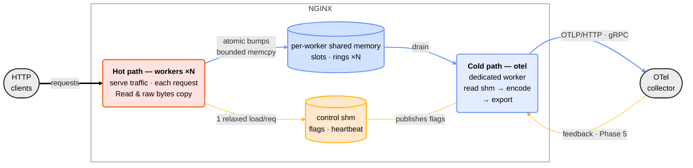

# Architecture

## Overview

*Read left to right: requests enter on the left, telemetry leaves on the right.
The two large nodes are the design thesis — the **hot path** (warm red) does
constant, lock-free work on every request and never serialises; the **cold path**
(blue) is one dedicated process, spawned and respawned by the nginx master, that
does all wire-format work once per interval. Shared memory (cylinders) is the
only thing the two share: workers hold zero collector sockets, and when a ring
fills, telemetry drops — counted — while traffic is untouched. On the hot path,
REWRITE starts the span and parses any inbound `traceparent` once; LOG bumps
histograms and writes exemplars, tail records, and the span end. Edge colours:
**user traffic** black (thick) · **telemetry** blue `#648FFF` · **control** amber
`#FFB000`, dashed — the exporter publishes flags that workers read with one
relaxed atomic load per request; the collector-side feedback half (and OTAP
transport) is Phase 5.*

## Hot path — workers

Instrumented metrics live in per-worker shared-memory counter slots. A Log-phase
handler increments them atomically, and each worker writes only to its own slot,
so there is no cross-worker cache traffic.

**Design principle: the worker copies raw facts and never encodes; all
wire-format work is cold-path.** On the request path a worker only *aggregates
and defers*: a fixed set of `Relaxed` atomic increments into its own shm
histogram slots, plus — for the sampled exception tail only — a single bounded,
allocation-free copy into its own ring. That work is constant per request,
lock-free, and syscall-free, and its cost does not depend on the telemetry wire
format.

## Cold path — dedicated exporter

A **dedicated `nginx: otel exporter` child process** owns the entire cold path.
Its async export loop is driven by `ngx-rust`'s single-threaded executor. It
reads the worker slots plus NGINX core's `ngx_stat_*` atomics, encodes OTLP
protobuf, and sends the result over either [hyper] 1.x HTTP/1 or OTLP/gRPC on
HTTP/2. Both transports run on a `NgxConnIo` adapter, which wraps
`ngx_peer_connection_t` and uses NGINX's own event handlers for I/O-readiness
wakeup — no spinning, no blocking. Workers never open a collector connection.

Tokio appears in `Cargo.lock` as a type-level transitive dependency of the
hyper / h2 / tonic HTTP-2 and gRPC stack, but **no Tokio runtime is ever
instantiated** — the export loop runs entirely on `ngx-rust`'s single-threaded
executor over NGINX's event loop, and workers spawn no threads or runtime.

A small control shared-memory zone carries a liveness heartbeat plus a flags
word. Workers load that flags word once per request — one `Relaxed` atomic read,
the sole hot-path branch, reserved for future dynamic reconfiguration.

The `MetricSource` and `Encoder` trait boundaries, plus the `ExportTransport`
enum that dispatches between OTLP/HTTP and OTLP/gRPC, keep an eventual OTAP /
columnar migration an encoder swap rather than a rewrite.

This one dedicated exporter is deliberately the **single cold path for all three
signals** — metrics (Phase 1), logs (Phase 2), and traces (Phase 3) — so
per-signal differences stay confined to the shared-memory shape while one process
owns all collector I/O. The per-worker-export alternative (the model the
production C++ `nginx/nginx-otel` module uses: a background thread and its own
connection in every worker) was weighed across all three signals and declined.

When `otel_exporter` is not configured the Log-phase handler is not registered
and the exporter process is not spawned — no work runs on the request path, no
background process runs. This is the "zero-cost-when-disabled" invariant.

[hyper]: https://hyper.rs/

## Design invariants

Three invariants follow from the hot/cold split.

1. **The request path does zero wire-format work.** It copies raw facts —
   atomic bumps and bounded memcpys into shared memory — and never serialises.
   Anything that shapes bytes for a wire format is pushed to the cold path.
2. **Read once, derive many.** Each request datum is read once, at the phase
   that owns it: inbound trace context at the `rewrite` phase, parsed once and
   cached on the per-request context; the request outcome at the `log` phase,
   in one pass. Every signal — metric, log, span — is derived from those
   captured reads. No signal re-reads or re-scans a field another signal already
   read.
3. **"Zero wire-byte change" is the bar for refactoring telemetry code.** A
   change that leaves the emitted OTLP bytes byte-for-byte identical is a pure
   refactor, gated by the existing tests. A change that alters them is a
   behaviour change, and is treated as such.

Invariants (1) and (2) govern *what a worker does* per request; (3) governs
*how we change the code that produces bytes*.

## Windowed aggregation and scaling characteristics

The exporter is a **windowed-aggregation engine at the edge**: each signal is
reduced over a time window before it leaves the process. That is what keeps the
hot path cheap and the exported volume bounded as load grows.

- **Metrics** aggregate over the `otel_metric_interval` (a tumbling window):
  workers bump histogram/counter slots continuously; once per interval the
  exporter snapshots and emits one aggregated point per series. The request path
  never serialises a metric.
- **Logs** are reduced over the drain window (250 ms): identical error templates
  **coalesce** into a single `LogRecord` carrying `coalesced_count`, paired with
  a companion rate metric, while the high-value exception tail rides a bounded
  reservoir. A firehose of repeated errors becomes *count + representative
  sample* rather than N records — windowed reduction applied to logs.
- **Traces** batch over the same 250 ms drain window: spans accumulate in a
  per-worker ring and ship as one batch per window.

Because the reduction happens inside the window, the **two aggregated signals
(metrics and summary-logs) scale essentially for free** — more load raises the
per-window counts, not the number of exported records or the per-request cost.
That property is why they are default-on.

**Traces are the exception, and we measured it.** A span is per-request and
cannot be aggregated, so it does not inherit the windowing win. On a single
worker at 100% sampling, the exporter sustains roughly 10k spans per second per
worker; beyond that, the per-worker ring fills and excess spans drop. The drop
is graceful — drop-on-full is cheap and request latency is unaffected — and
observable, counted by `ngx_otel.traces.dropped_records`. The ceiling is set by
the per-drain budget (at most 2,500 spans per worker drained every 250 ms), not
by exporter CPU, which sits around 2% at the ceiling. That is a deliberate
sizing choice: raising the ceiling means enlarging the drain budget and the ring
together, and chunking the send to stay below the gRPC maximum message size.
Practical guidance: metrics and summary-logs are cheap enough to leave on by
default; for high-volume tracing, sample down or raise the trace buffers.
Measurements:
[`tests/bench/RESULTS-span-saturation-2026-06-09.md`](../tests/bench/RESULTS-span-saturation-2026-06-09.md).
